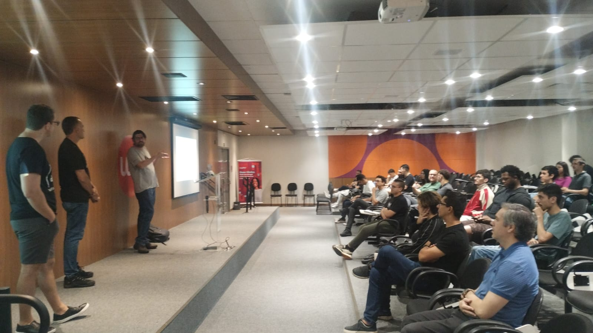

# Arquitetura-WellArchitected-12FactorApp-2025-03
Fotos e informações gerais sobre o evento "Arquitetura: Well-Architected Framework + Twelve-Factor App", realizado em 22/03/2025 na cidade de Campinas-SP.

Organizadores:
- **João Ronaldo Cunha (UniMetrocamp)**
- **Renato Groffe (Microsoft MVP, MTAC)**

Apresentações:
- **Azure Well-Architected Framework: uma visão geral**
- **Twelve-Factor App - Boas Práticas em Aplicações na Nuvem... e também fora dela...**

Palestrantes (em ambas as apresentações):
- **Renato Groffe (Microsoft MVP, Docker Captain, APIsec U Ambassador, MTAC)**
- **Marcio Nizzola (Microsoft MVP)**
- **Murilo Beltrame (Solutions Architect, DEVPIRA)**

Número de participantes: **35 pessoas**

Tópicos e tecnologias abordados: **Azure Well-Architected Framework, Twelve-Factor App, LGPD, GDPR, PCI DSS (Payment Card Industry Data Security Standard), Containers, Docker, Docker Compose, Testcontainers, Kubernetes, DevOps, Blue Green Deployments, Release Canary Deployments, Linux, API Security, Azure Kubernetes Service, Azure Container Apps, Azure App Service, Azure Functions, Azure Front Door, Azure Load Balancer, Azure CDN, Azure Monitor, Azure Log Analytics, Application Insights, Azure DevOps, GitHub Actions, Azure Subscriptions, Azure Policies, ARM, Bicep, Azure CLI, Azure Site Recovery, Azure Regions, Azure Availability Zones, Microsoft Entra ID, Network Security Groups, Azure Private Endpoints, Azure Key Vault, Azure App Configuration, Azure API Management, Azure Cost Management, Azure Reservations, Azure Pricing Calculator, Azure SQL, SQL Server, Oracle, Bash, PowerShell, Terraform, Grafana, Prometheus, Git, NuGet, Maven, npm, HashiCorp Vault, Dapr, PostgreSQL, SQLite, RabbitMQ, Azure Service Bus, Jenkins, Redis, Azure Redis Cache, KEDA (Kubernetes Event-driven Autoscaling), Helm, OpenTelemetry, Azure Automation...**

Acesse este [**link**](/img/) para visualizar todas as fotos das apresentações.

Este evento foi uma parceria entre a comunidade [**Campinas .NET**](https://www.meetup.com/campinasdotnet/) e a [**UniMetrocamp**](https://www.wyden.com.br/unidades/unimetrocamp).

Formulário utilizado para inscrições: [**Sympla**](https://www.sympla.com.br/evento/arquitetura-well-architected-framework-twelve-factor-app-gratuito-e-presencial-campinas-sp/2870786)

Local: UniMetrocamp - Rua Dr. Sales de Oliveira, 1661 - Vila Industrial - próximo da Rodoviária - CEP: 13035-500 - Campinas - SP

